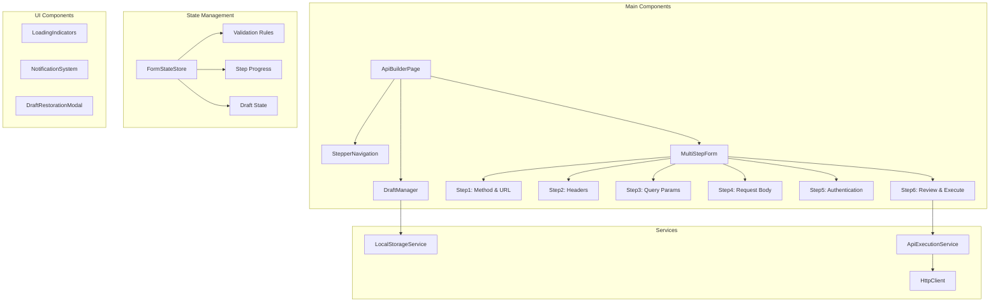
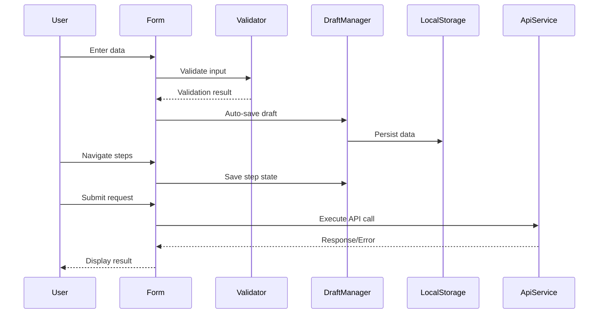

# REST API Form Builder Architecture

## Overview
A sophisticated multi-step form interface for building REST API request payloads with draft persistence, real-time validation, and execution capabilities.

## Component Architecture

## Data Flow

## Form Steps Detail

### Step 1: HTTP Method & URL
- Method selector (GET, POST, PUT, DELETE, PATCH)
- URL input with validation
- Base URL configuration option

### Step 2: Request Headers
- Dynamic key-value pairs
- Common header presets
- Add/remove functionality
- Validation for header format

### Step 3: Query Parameters
- Dynamic key-value pairs
- URL encoding preview
- Parameter validation

### Step 4: Request Body
- JSON editor with syntax highlighting
- Schema validation
- Format beautification
- Raw/formatted view toggle

### Step 5: Authentication
- Type selector (None, Bearer Token, Basic Auth, API Key)
- Credential inputs based on type
- Secure storage considerations

### Step 6: Review & Execute
- Complete request preview
- Inline editing capability
- Execute button with loading state
- Response viewer

## Key Features

1. **Draft Persistence**
   - Auto-save on field change
   - Step navigation saves state
   - Periodic background saves
   - Browser event handling

2. **Validation**
   - Real-time field validation
   - Step completion requirements
   - JSON schema validation
   - URL format validation

3. **User Experience**
   - Horizontal stepper navigation
   - Progress indicators
   - Keyboard navigation
   - Responsive design
   - Accessibility compliance

4. **Error Handling**
   - Network error recovery
   - Validation error display
   - Retry mechanisms
   - User-friendly messages