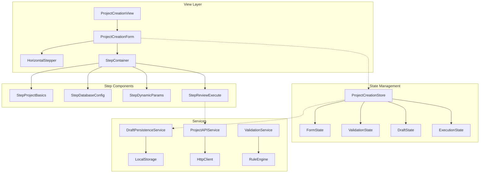
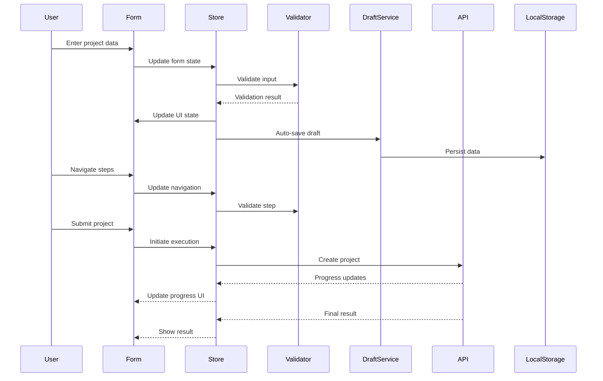
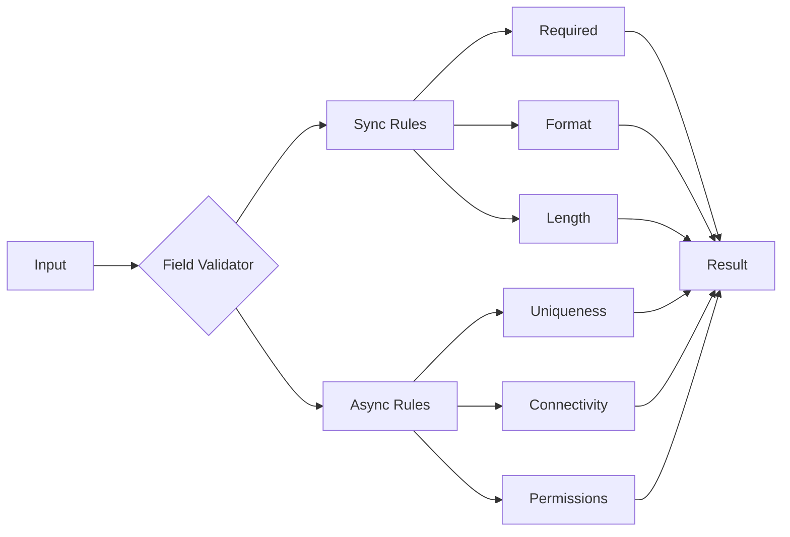

# Project Creation Form Architecture

## Executive Summary

This document outlines the comprehensive architecture for a sophisticated multi-step project creation form interface. The design leverages existing patterns from the API Builder components while introducing project-specific enhancements for database configuration, parameter management, and API execution workflows.

## Table of Contents

1. [Architecture Overview](#architecture-overview)
2. [Component Hierarchy](#component-hierarchy)
3. [Data Flow & State Management](#data-flow--state-management)
4. [Type Definitions](#type-definitions)
5. [Validation Architecture](#validation-architecture)
6. [API Integration Patterns](#api-integration-patterns)
7. [Routing Strategy](#routing-strategy)
8. [Reusability Assessment](#reusability-assessment)
9. [Implementation Recommendations](#implementation-recommendations)

## Architecture Overview

The project creation form follows a horizontal stepper pattern with discrete phases:
- **Step 1**: Project Fundamentals (name, description, type)
- **Step 2**: Database Configuration (connection, schema)
- **Step 3-N**: Dynamic Parameter Steps (based on project type)
- **Final Step**: Review & Execute with API integration

### High-Level Architecture



## Component Hierarchy

### 1. Container Components

```typescript
// ProjectCreationView.vue
- Manages overall layout and navigation
- Handles draft restoration modal
- Coordinates with router for navigation

// ProjectCreationForm.vue
- Core form orchestrator
- Manages step transitions
- Handles form submission
- Integrates auto-save functionality
```

### 2. Navigation Components

```typescript
// HorizontalStepper.vue
- Visual stepper with progress indication
- Step validation indicators
- Click navigation for completed steps
- Responsive design for mobile/desktop

// StepIndicator.vue
- Individual step status display
- Visual feedback for validation state
- Progress animation
```

### 3. Step Components

```typescript
// StepProjectBasics.vue
- Project name, description, type selection
- Template selection
- Basic validation

// StepDatabaseConfig.vue
- Database type selection
- Connection string builder
- Schema configuration
- Test connection functionality

// StepDynamicParams.vue
- Dynamically generated based on project type
- Flexible parameter input
- Conditional rendering logic

// StepReviewExecute.vue
- Complete configuration preview
- Inline editing capability
- API execution with progress
- Error handling display
```

### 4. Shared Components

```typescript
// DraftRestorationModal.vue
- Draft detection on mount
- Restoration options
- Merge capabilities

// ProgressIndicator.vue
- API call progress display
- Cancellable operations
- Error state handling

// ValidationFeedback.vue
- Field-level validation messages
- Step-level validation summary
```

## Data Flow & State Management

### State Architecture

```typescript
interface ProjectCreationState {
  // Form Data
  formData: ProjectFormData
  
  // Navigation State
  navigation: {
    currentStep: number
    completedSteps: number[]
    totalSteps: number
    canNavigateBack: boolean
    canNavigateForward: boolean
  }
  
  // Validation State
  validation: {
    stepValidation: Record<number, StepValidationResult>
    globalValidation: GlobalValidationResult
    isDirty: boolean
  }
  
  // Draft State
  draft: {
    hasDraft: boolean
    lastSaved: number
    autoSaveEnabled: boolean
    autoSaveInterval: number
  }
  
  // Execution State
  execution: {
    status: 'idle' | 'preparing' | 'executing' | 'success' | 'error'
    progress: number
    message: string
    result?: ProjectCreationResult
    error?: Error
  }
}
```

### Data Flow Diagram



## Type Definitions

### Core Types

```typescript
// Project Form Data Types
interface ProjectFormData {
  basics: ProjectBasics
  database: DatabaseConfig
  parameters: DynamicParameters
  metadata: ProjectMetadata
}

interface ProjectBasics {
  name: string
  description: string
  type: ProjectType
  template?: string
  tags: string[]
}

interface DatabaseConfig {
  type: 'postgresql' | 'mysql' | 'mongodb' | 'sqlite'
  connectionString: string
  schema?: string
  options: DatabaseOptions
}

interface DynamicParameters {
  [key: string]: ParameterValue
}

type ParameterValue = 
  | string 
  | number 
  | boolean 
  | string[] 
  | ParameterObject

interface ParameterObject {
  value: any
  metadata?: {
    source?: string
    validated?: boolean
    encrypted?: boolean
  }
}

// Validation Types
interface StepValidationResult {
  valid: boolean
  errors: ValidationError[]
  warnings: ValidationWarning[]
  touched: boolean
}

interface ValidationError {
  field: string
  message: string
  code: string
  severity: 'error' | 'critical'
}

// Execution Types
interface ProjectCreationResult {
  projectId: string
  status: 'created' | 'pending' | 'failed'
  url: string
  metadata: {
    createdAt: number
    duration: number
    steps: ExecutionStep[]
  }
}
```

## Validation Architecture

### Validation Strategy

```typescript
class ProjectValidationService {
  // Step-specific validators
  validateProjectBasics(data: ProjectBasics): ValidationResult
  validateDatabaseConfig(data: DatabaseConfig): ValidationResult
  validateParameters(data: DynamicParameters, schema: ParameterSchema): ValidationResult
  
  // Cross-step validation
  validateStepTransition(from: number, to: number, formData: ProjectFormData): boolean
  validateFormCompletion(formData: ProjectFormData): GlobalValidationResult
  
  // Async validation
  async validateProjectName(name: string): Promise<ValidationResult>
  async testDatabaseConnection(config: DatabaseConfig): Promise<ConnectionTestResult>
}
```

### Validation Rules



## API Integration Patterns

### API Service Architecture

```typescript
class ProjectCreationAPI {
  // Pre-flight checks
  async validateConfiguration(config: ProjectFormData): Promise<ValidationResult>
  
  // Main execution
  async createProject(
    config: ProjectFormData,
    options: ExecutionOptions
  ): Promise<ProjectCreationResult>
  
  // Progress tracking
  onProgress(callback: (progress: ProgressEvent) => void): void
  
  // Cancellation
  cancel(): void
  
  // Error recovery
  async retry(lastAttempt: FailedAttempt): Promise<ProjectCreationResult>
}
```

### Progress Tracking

```typescript
interface ProgressEvent {
  stage: 'validating' | 'preparing' | 'creating' | 'configuring' | 'finalizing'
  progress: number // 0-100
  message: string
  details?: {
    currentStep: string
    totalSteps: number
    estimatedTime?: number
  }
}
```

## Routing Strategy

### Route Configuration

```typescript
const projectRoutes: RouteRecordRaw[] = [
  {
    path: '/projects',
    component: ProjectsLayout,
    children: [
      {
        path: 'create',
        name: 'ProjectCreate',
        component: ProjectCreationView,
        meta: {
          title: 'Create New Project',
          requiresAuth: true,
          breadcrumb: [
            { text: 'Projects', to: '/projects' },
            { text: 'Create New', active: true }
          ]
        },
        beforeEnter: (to, from, next) => {
          // Check for existing drafts
          const draftService = new DraftPersistenceService()
          if (draftService.hasDraft()) {
            // Will be handled by component
          }
          next()
        }
      },
      {
        path: 'create/:step',
        name: 'ProjectCreateStep',
        component: ProjectCreationView,
        props: route => ({
          initialStep: parseInt(route.params.step as string)
        })
      }
    ]
  }
]
```

### Navigation Guards

```typescript
// Step navigation guard
const stepNavigationGuard = (
  to: RouteLocationNormalized,
  from: RouteLocationNormalized,
  next: NavigationGuardNext
) => {
  const store = useProjectCreationStore()
  const requestedStep = parseInt(to.params.step as string)
  
  if (store.canNavigateToStep(requestedStep)) {
    next()
  } else {
    // Redirect to highest valid step
    next({ 
      name: 'ProjectCreateStep', 
      params: { step: store.highestValidStep.toString() } 
    })
  }
}
```

## Reusability Assessment

### Reusable Components from API Builder

1. **StepperNavigation.vue**
   - Can be adapted for horizontal layout
   - Progress indication logic is reusable
   - Validation state display is applicable

2. **MultiStepForm.vue**
   - Core orchestration logic is reusable
   - Auto-save functionality can be extracted
   - Step transition logic is applicable

3. **Validation Patterns**
   - Field validation approach
   - Step validation guards
   - Real-time validation feedback

4. **Type Patterns**
   - KeyValuePair interface for parameters
   - StepValidation patterns
   - FormState management approach

### New Components Required

1. **HorizontalStepper.vue** - New horizontal layout
2. **DraftRestorationModal.vue** - Project-specific
3. **DatabaseConfigBuilder.vue** - New functionality
4. **ParameterInputDynamic.vue** - Dynamic form generation
5. **ProjectExecutionProgress.vue** - Enhanced progress display

## Implementation Recommendations

### Phase 1: Foundation (Week 1)
- Set up project creation route and view
- Implement HorizontalStepper component
- Create basic step components structure
- Set up Pinia store for state management

### Phase 2: Core Functionality (Week 2)
- Implement step components with validation
- Add draft persistence service
- Create type definitions
- Implement step navigation logic

### Phase 3: Advanced Features (Week 3)
- Add dynamic parameter generation
- Implement database configuration UI
- Create API integration service
- Add progress tracking

### Phase 4: Polish & Testing (Week 4)
- Implement inline editing in review step
- Add comprehensive error handling
- Create unit and integration tests
- Optimize performance and accessibility

### Best Practices

1. **Component Design**
   - Keep steps as independent modules
   - Use composition API for logic reuse
   - Implement proper TypeScript types

2. **State Management**
   - Use Pinia for centralized state
   - Implement computed getters for derived state
   - Keep actions pure and testable

3. **Performance**
   - Lazy load step components
   - Debounce auto-save operations
   - Optimize validation runs

4. **Accessibility**
   - ARIA labels for stepper navigation
   - Keyboard navigation support
   - Screen reader announcements

5. **Error Handling**
   - Graceful degradation
   - User-friendly error messages
   - Recovery mechanisms

## Conclusion

This architecture provides a robust foundation for implementing a sophisticated project creation form. It leverages existing patterns while introducing new capabilities specific to project creation workflows. The modular design ensures maintainability and extensibility for future enhancements.