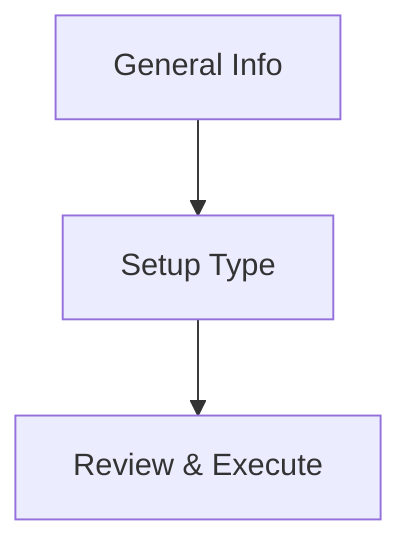

# Project Creation Architecture

## Overview

This document describes the project creation process and application flow, with a focus on the Setup Type step and its implications for database configuration.

---

## Project Creation Flow

---

## Setup Type Step

After entering general project information and entitlements, you must select a **Setup Type**:

### Options

- **OAD (Organization Account Delegation)**
  - Preferred option for new projects.
  - Uses delegated organization accounts for streamlined access and management.
  - Simplifies permissions and future scaling.
  - Recommended for most users.

- **Classic**
  - Legacy setup for compatibility with older workflows.
  - Uses direct user/service accounts.
  - May require more manual configuration and maintenance.

### Key Differences

| Feature                | OAD (Preferred)                | Classic                |
|------------------------|-------------------------------|------------------------|
| Account Model          | Delegated org accounts         | Direct user/service    |
| Permissions            | Centralized, easier to manage  | Manual, per-user       |
| Scaling                | Designed for future growth     | May require rework     |
| Maintenance            | Lower ongoing effort           | Higher, more manual    |
| Compatibility          | New projects                   | Legacy/compatibility   |

### Why OAD is Preferred

- Reduces manual steps and risk of misconfiguration.
- Supports organizational policies and scaling.
- Easier to maintain and audit.

### Database Configuration Implications

- **OAD**: Database setup is automated for delegated accounts. YAML and environment setup are streamlined.
- **Classic**: Database setup may require more manual YAML and environment configuration. Some automation may not be available.

---

## Next Steps

After selecting the Setup Type, the flow continues to database configuration, YAML generation, and environment setup, as shown in the diagram above.
