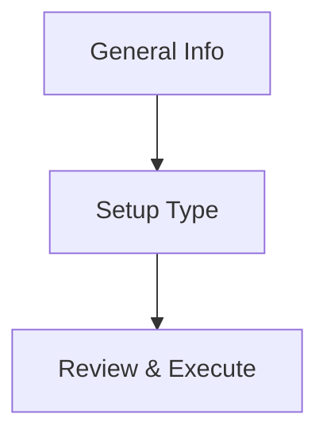
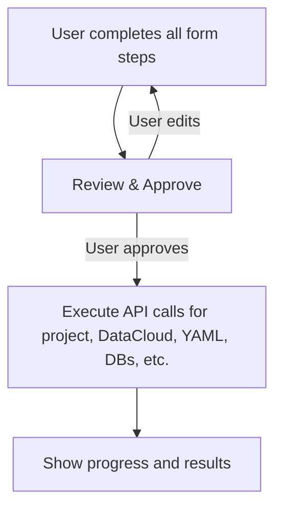

# Project Creation Workflow Specification

## Overview

This document consolidates the complete project creation workflow for the dbt Self-Service Portal, including the canonical flow, remediation plan, implementation checklists, and a summary of implementation differences. It is the single source of truth for all future development and remediation.

---

## 1. Canonical Project Creation Flow

> **Note:** The flow now includes an explicit "Database Needed" step and contextual requirements for DataCloud/ShellCreator YAML. See [docs/datacloud.md](docs/datacloud.md) for YAML details.



---

## 2. Database Selection Step

After selecting the setup type ("Classic" or "OAD"), the user is prompted to specify the database for the project using the following UI:

- **Database Name Input:**
  - An input field is always shown for the user to enter the name of an existing database.
  - Validation ensures the field is not empty before proceeding.

- **Create New Database Option:**
  - A button labeled "Create New Database" is provided.
  - If clicked, the user is guided through a form to define a new database (fields: name, entitlement bases, schemas, optional custom tags).
  - All new database details are collected via `DatabaseNeededStep.vue` and `DatabaseInfoForm.vue`.
  - State is managed in Pinia store `projectCreationForm.ts` (`databases: DatabaseConfig[]`).
  - DataCloud/ShellCreator YAML is required for new databases.

- **State Management and UI Logic:**
  - The `databases` array in Pinia is updated based on user input (existing or new).
  - UI and validation logic remain in `DatabaseNeededStep.vue` and `DatabaseInfoForm.vue`.
  - This step is rendered between "Setup Type" and "Environments" in `ProjectCreation.vue`.

**Wireframe Flow:**

```mermaid
flowchart TD
    A[User selects Setup Type] --> B[Database Selection Step]
    B --> C[Enter existing database name]
    B --> D[Click "Create New Database"]
    D --> E[Fill new database details]
    E --> F[Database created and selected]
    C --> G[Proceed to Environments Step]
    F --> G
```

---

## 3. Remediation Plan & Outstanding TODOs

### Gaps Identified

1. DataCloud invocation is missing.
2. YAML generation/addition is missing.
3. OAD-specific database logic is missing.
4. Explicit "Create new databases?" decision is missing.
5. Documentation/UX for branching is unclear.
6. API calls to create the project and its components must only be executed after user approval on the review page.
7. Parameters and process for DataCloud/ShellCreator database setup are not integrated into the flow or UI.

### Remediation Plan



#### TODOs

- [ ] Integrate DataCloud (ShellCreator) parameters and process into orchestration.
- [ ] Generate YAML files for DEV/QA/PROD (Classic) or _USER/_TEAM (OAD) after user approval.
- [ ] Support creation of multiple OAD databases with correct YAML and entitlement structure.
- [ ] Add explicit "Need databases?" decision in the UI.
- [ ] Improve documentation and UX to clarify branching and conditional steps.
- [ ] Ensure all API calls are deferred until after user confirms on the review step.
- [ ] Integrate DataCloud/ShellCreator parameter guidance into the UI.
- [ ] Test both Classic and OAD flows, including all branches and error cases.
- [ ] Update documentation to match the implemented flow.

---

## 4. Implementation Details

### Component Architecture

- **ProjectCreationView**: Orchestrates the workflow, manages step state, handles submission.
- **Stepper**: Uses `v-stepper` for navigation.
- **Step Components**: Each step is a self-contained SFC, communicates via props/events or Pinia.

**Component List:**

- ProjectCreationView.vue
- ProjectCreationStepper.vue
- steps/GeneralInfoStep.vue
- steps/SetupTypeStep.vue
- steps/EnvironmentsStep.vue
- steps/DatabaseConnectionStep.vue
- steps/GitHubSetupStep.vue
- steps/EntitlementsStep.vue
- steps/NotificationsStep.vue
- steps/ReviewCreateStep.vue

### State Management

- Use Pinia for global workflow state (`useProjectCreationFormStore`).
- All step data is stored centrally for validation, review, and submission.
- Strict TypeScript types for all state fields.

### Form Handling & Validation

- Use Vuetify's `v-form` and controls.
- Use VeeValidate for schema-based validation.
- Each step validates its own fields before navigation.
- Mask sensitive fields.

### Navigation Flow

- Use `v-stepper` for multi-step navigation.
- Steps are only accessible if previous steps are valid.
- Allow users to go back and edit previous steps.
- Final step displays a summary and "Create Project" button.

### Data Validation Rules

- Enforce all mandatory fields as per technical specification.
- Validate:
  - Project Name, Git Repo, Setup Type
  - Environment dependencies (QA requires Dev, Prod requires QA)
  - All Snowflake connection fields per enabled environment
  - Connection test must pass for each enabled environment
- Use both client-side and server-side validation.

### API Integration

- Use Axios or Fetch for backend interaction.
- During development, point all API calls to the mock server.
- Never store secrets in the frontend.

### Accessibility & UX

- Follow WCAG 2.1 AA guidelines.
- All interactive elements are keyboard accessible.
- Use Vuetify's built-in accessibility features.
- Provide clear focus indicators, ARIA labels, and semantic HTML.

### Draft Saving

- Use Pinia store to persist form state.
- Save draft to localStorage (or backend if needed) on each step or field change.
- Provide "Save Draft" and "Load Draft" actions in the UI.

### Backend Orchestration

- Use `projectCreationService.createCompleteProject` to orchestrate all backend calls in order.
- Report progress and errors to the user at each step.

---

## 5. Implementation Checklist

- [ ] Create all step components as SFCs using Vuetify controls.
- [ ] Implement Pinia store for workflow state.
- [ ] Add VeeValidate schemas for each step.
- [ ] Implement navigation logic in ProjectCreationView and ProjectCreationStepper.
- [ ] Integrate API calls for project creation and connection testing.
- [ ] Add accessibility features and test with keyboard/screen reader.
- [ ] Write unit/component tests for each step.
- [ ] Document all props, events, and store fields.
- [ ] Replace all Volt Vue components with Vuetify equivalents.
- [ ] Refactor layouts to use Vuetify's grid and spacing utilities.
- [ ] Update all forms to use Vuetify controls and validation.
- [ ] Ensure all state is managed via Pinia and strictly typed.
- [ ] Test all navigation and validation flows.
- [ ] Update tests to use Vuetify components.
- [ ] Review accessibility (WCAG 2.1 AA) with Vuetify's built-in features.

---

## 6. Summary Table: Implementation Differences

| Area                | Legacy (Volt Vue)           | New (Vuetify, Greenfield)         | Status / Notes                |
|---------------------|-----------------------------|-----------------------------------|-------------------------------|
| UI Framework        | Volt Vue                    | Vuetify (Vue 3, TS, Pinia)        | Migration in progress         |
| State Management    | Pinia (basic)               | Pinia (strict types, centralized) | Enhanced, stricter typing     |
| Step Components     | Volt SFCs                   | Vuetify SFCs                      | All steps migrated            |
| Validation          | Manual/Basic                | VeeValidate + Vuetify             | Improved, schema-based        |
| Accessibility       | Partial                     | WCAG 2.1 AA, Vuetify a11y         | Improved                      |
| Draft Saving        | Not present                 | Pinia + localStorage              | New feature                   |
| DataCloud/YAML      | Not integrated              | Explicit step, YAML generation    | TODO                          |
| OAD Logic           | Partial                     | Full branching, OAD-specific      | TODO                          |
| API Orchestration   | Inline, stepwise            | Centralized, deferred until review| Improved, matches spec        |
| Documentation       | Fragmented                  | Consolidated in this spec         | This document                 |

---

## 7. References

- [`docs/project-creation-flow.md`](../docs/project-creation-flow.md)
- [`docs/project-creation-remediation-plan.md`](../docs/project-creation-remediation-plan.md)
- [`docs/frontend/project-creation-implementation.md`](../docs/frontend/project-creation-implementation.md)
- [`docs/frontend/project-creation-implementation-plan.md`](../docs/frontend/project-creation-implementation-plan.md)
- [`docs/frontend/legacy-specs/ProjectCreationWorkflowGuide.md`](../docs/frontend/legacy-specs/ProjectCreationWorkflowGuide.md)

---
