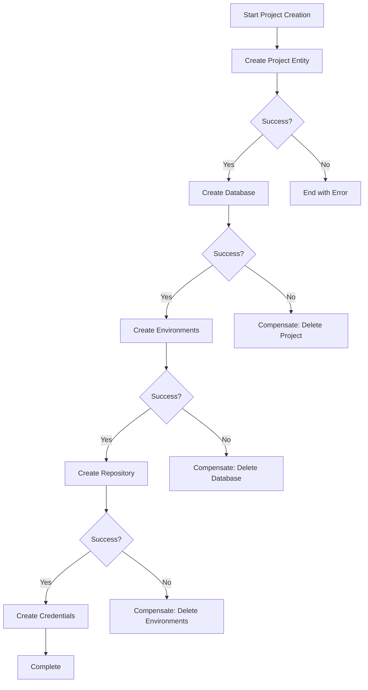

# Backend Orchestration Strategy for dbt Cloud Project Creation

## Executive Summary

This document outlines a comprehensive backend orchestration strategy for the dbt Cloud project creation workflow, focusing on reliability, scalability, and maintainability while adhering to the Baby Steps™ methodology.

## Architecture Patterns and Service Coordination

### 1. Orchestration Pattern: Saga Pattern with Compensating Transactions



### 2. Service Coordination Mechanisms

#### a. API Gateway Pattern
```typescript
// src/services/orchestration/ApiGateway.ts
export class ProjectCreationGateway {
  private readonly endpoints = {
    project: '/api/v1/dbt/projects',
    database: '/api/v1/admin/datacloud/provision-infra',
    snowflake: '/api/v1/admin/snowflake',
    github: '/api/v1/admin/github',
    entitlements: '/api/v1/admin/pims/entitlements'
  };

  async orchestrateProjectCreation(workflow: ProjectWorkflow): Promise<ProjectResult> {
    const saga = new ProjectCreationSaga(workflow);
    return await saga.execute();
  }
}
```

#### b. Service Registry
```typescript
// src/services/orchestration/ServiceRegistry.ts
export class ServiceRegistry {
  private services: Map<string, IService> = new Map();

  register(name: string, service: IService): void {
    this.services.set(name, service);
  }

  getService(name: string): IService {
    const service = this.services.get(name);
    if (!service) throw new ServiceNotFoundError(name);
    return service;
  }
}
```

## Workflow Management Approaches

### 1. State Machine Implementation

```typescript
// src/services/orchestration/ProjectCreationStateMachine.ts
export enum ProjectCreationState {
  INITIAL = 'INITIAL',
  PROJECT_CREATED = 'PROJECT_CREATED',
  DATABASE_PROVISIONED = 'DATABASE_PROVISIONED',
  ENVIRONMENTS_CREATED = 'ENVIRONMENTS_CREATED',
  REPOSITORY_CONFIGURED = 'REPOSITORY_CONFIGURED',
  CREDENTIALS_CREATED = 'CREDENTIALS_CREATED',
  ENTITLEMENTS_ASSIGNED = 'ENTITLEMENTS_ASSIGNED',
  COMPLETED = 'COMPLETED',
  FAILED = 'FAILED',
  COMPENSATING = 'COMPENSATING'
}

export class ProjectCreationStateMachine {
  private currentState: ProjectCreationState = ProjectCreationState.INITIAL;
  private stateHistory: StateTransition[] = [];

  async transition(action: Action): Promise<void> {
    const nextState = this.getNextState(this.currentState, action);
    this.stateHistory.push({
      from: this.currentState,
      to: nextState,
      action,
      timestamp: new Date()
    });
    this.currentState = nextState;
  }
}
```

### 2. Task Scheduling with Priority Queue

```typescript
// src/services/orchestration/TaskScheduler.ts
export class TaskScheduler {
  private taskQueue: PriorityQueue<Task> = new PriorityQueue();
  private executors: TaskExecutor[] = [];

  async scheduleTask(task: Task, priority: Priority): Promise<void> {
    this.taskQueue.enqueue(task, priority);
    await this.processNextTask();
  }

  private async processNextTask(): Promise<void> {
    const availableExecutor = this.getAvailableExecutor();
    if (availableExecutor && !this.taskQueue.isEmpty()) {
      const task = this.taskQueue.dequeue();
      await availableExecutor.execute(task);
    }
  }
}
```

## Inter-Service Communication

### 1. Message Queue Implementation

```typescript
// src/services/messaging/MessageQueue.ts
export interface MessageQueue {
  publish(topic: string, message: Message): Promise<void>;
  subscribe(topic: string, handler: MessageHandler): void;
  unsubscribe(topic: string, handler: MessageHandler): void;
}

export class InMemoryMessageQueue implements MessageQueue {
  private topics: Map<string, Set<MessageHandler>> = new Map();

  async publish(topic: string, message: Message): Promise<void> {
    const handlers = this.topics.get(topic) || new Set();
    for (const handler of handlers) {
      await handler(message);
    }
  }
}
```

### 2. Event-Driven Architecture

```typescript
// src/services/events/ProjectCreationEvents.ts
export enum ProjectCreationEventType {
  PROJECT_CREATION_STARTED = 'PROJECT_CREATION_STARTED',
  PROJECT_CREATED = 'PROJECT_CREATED',
  DATABASE_PROVISION_STARTED = 'DATABASE_PROVISION_STARTED',
  DATABASE_PROVISIONED = 'DATABASE_PROVISIONED',
  STEP_FAILED = 'STEP_FAILED',
  COMPENSATION_STARTED = 'COMPENSATION_STARTED',
  COMPENSATION_COMPLETED = 'COMPENSATION_COMPLETED'
}

export class ProjectCreationEventBus {
  private eventStore: EventStore;
  private subscribers: Map<string, EventHandler[]> = new Map();

  async emit(event: ProjectCreationEvent): Promise<void> {
    await this.eventStore.append(event);
    await this.notifySubscribers(event);
  }
}
```

## State Management and Distributed Transactions

### 1. Distributed State Management

```typescript
// src/services/state/DistributedStateManager.ts
export class DistributedStateManager {
  private stateStore: StateStore;
  private lockManager: DistributedLockManager;

  async updateState(key: string, updater: StateUpdater): Promise<void> {
    const lock = await this.lockManager.acquire(key);
    try {
      const currentState = await this.stateStore.get(key);
      const newState = await updater(currentState);
      await this.stateStore.set(key, newState);
    } finally {
      await lock.release();
    }
  }
}
```

### 2. Transaction Coordinator

```typescript
// src/services/transactions/TransactionCoordinator.ts
export class TransactionCoordinator {
  private transactions: Map<string, Transaction> = new Map();

  async beginTransaction(id: string): Promise<Transaction> {
    const transaction = new DistributedTransaction(id);
    this.transactions.set(id, transaction);
    return transaction;
  }

  async commit(transactionId: string): Promise<void> {
    const transaction = this.transactions.get(transactionId);
    if (!transaction) throw new TransactionNotFoundError(transactionId);
    
    try {
      await transaction.prepare();
      await transaction.commit();
    } catch (error) {
      await transaction.rollback();
      throw error;
    }
  }
}
```

## Error Handling and Resilience

### 1. Retry Logic with Exponential Backoff

```typescript
// src/services/resilience/RetryPolicy.ts
export class ExponentialBackoffRetry implements RetryPolicy {
  constructor(
    private maxRetries: number = 3,
    private baseDelay: number = 1000,
    private maxDelay: number = 30000
  ) {}

  async execute<T>(operation: () => Promise<T>): Promise<T> {
    let lastError: Error;
    
    for (let attempt = 0; attempt <= this.maxRetries; attempt++) {
      try {
        return await operation();
      } catch (error) {
        lastError = error;
        if (attempt < this.maxRetries) {
          const delay = Math.min(
            this.baseDelay * Math.pow(2, attempt),
            this.maxDelay
          );
          await this.sleep(delay);
        }
      }
    }
    
    throw new RetryExhaustedError(lastError, this.maxRetries);
  }
}
```

### 2. Circuit Breaker Implementation

```typescript
// src/services/resilience/CircuitBreaker.ts
export class CircuitBreaker {
  private state: CircuitState = CircuitState.CLOSED;
  private failureCount: number = 0;
  private lastFailureTime: Date | null = null;
  private successCount: number = 0;

  constructor(
    private threshold: number = 5,
    private timeout: number = 60000,
    private resetTimeout: number = 30000
  ) {}

  async execute<T>(operation: () => Promise<T>): Promise<T> {
    if (this.state === CircuitState.OPEN) {
      if (this.shouldAttemptReset()) {
        this.state = CircuitState.HALF_OPEN;
      } else {
        throw new CircuitOpenError();
      }
    }

    try {
      const result = await operation();
      this.onSuccess();
      return result;
    } catch (error) {
      this.onFailure();
      throw error;
    }
  }
}
```

### 3. Compensation Logic

```typescript
// src/services/orchestration/CompensationManager.ts
export class CompensationManager {
  private compensations: CompensationAction[] = [];

  register(action: CompensationAction): void {
    this.compensations.unshift(action); // LIFO order
  }

  async compensate(): Promise<void> {
    for (const compensation of this.compensations) {
      try {
        await compensation.execute();
      } catch (error) {
        console.error(`Compensation failed: ${error.message}`);
        // Continue with other compensations
      }
    }
  }
}
```

## Scalability Considerations

### 1. Load Balancing Strategy

```typescript
// src/services/loadbalancing/LoadBalancer.ts
export class RoundRobinLoadBalancer implements LoadBalancer {
  private currentIndex: number = 0;
  private instances: ServiceInstance[] = [];

  selectInstance(): ServiceInstance {
    if (this.instances.length === 0) {
      throw new NoAvailableInstanceError();
    }
    
    const instance = this.instances[this.currentIndex];
    this.currentIndex = (this.currentIndex + 1) % this.instances.length;
    return instance;
  }
}
```

### 2. Connection Pooling

```typescript
// src/services/connections/ConnectionPool.ts
export class ConnectionPool {
  private available: Connection[] = [];
  private inUse: Set<Connection> = new Set();
  private waitQueue: Array<(conn: Connection) => void> = [];

  constructor(
    private factory: ConnectionFactory,
    private minSize: number = 5,
    private maxSize: number = 20
  ) {
    this.initialize();
  }

  async acquire(): Promise<Connection> {
    if (this.available.length > 0) {
      const connection = this.available.pop()!;
      this.inUse.add(connection);
      return connection;
    }

    if (this.inUse.size < this.maxSize) {
      const connection = await this.factory.create();
      this.inUse.add(connection);
      return connection;
    }

    return new Promise((resolve) => {
      this.waitQueue.push(resolve);
    });
  }
}
```

## Monitoring and Observability

### 1. Metrics Collection

```typescript
// src/services/monitoring/MetricsCollector.ts
export class MetricsCollector {
  private metrics: Map<string, Metric> = new Map();

  recordDuration(name: string, duration: number, tags?: Tags): void {
    const metric = this.getOrCreateMetric(name, MetricType.HISTOGRAM);
    metric.record(duration, tags);
  }

  incrementCounter(name: string, value: number = 1, tags?: Tags): void {
    const metric = this.getOrCreateMetric(name, MetricType.COUNTER);
    metric.increment(value, tags);
  }

  recordGauge(name: string, value: number, tags?: Tags): void {
    const metric = this.getOrCreateMetric(name, MetricType.GAUGE);
    metric.set(value, tags);
  }
}
```

### 2. Distributed Tracing

```typescript
// src/services/tracing/DistributedTracer.ts
export class DistributedTracer {
  startSpan(name: string, parent?: SpanContext): Span {
    const span = new Span({
      name,
      traceId: parent?.traceId || this.generateTraceId(),
      spanId: this.generateSpanId(),
      parentSpanId: parent?.spanId,
      startTime: Date.now()
    });

    return span;
  }

  injectContext(span: Span, carrier: any): void {
    carrier['X-Trace-Id'] = span.traceId;
    carrier['X-Span-Id'] = span.spanId;
  }

  extractContext(carrier: any): SpanContext | null {
    const traceId = carrier['X-Trace-Id'];
    const spanId = carrier['X-Span-Id'];
    
    if (!traceId || !spanId) return null;
    
    return { traceId, spanId };
  }
}
```

### 3. Structured Logging

```typescript
// src/services/logging/StructuredLogger.ts
export class StructuredLogger {
  private context: LogContext = {};

  withContext(context: LogContext): StructuredLogger {
    return new StructuredLogger({
      ...this.context,
      ...context
    });
  }

  info(message: string, data?: any): void {
    this.log(LogLevel.INFO, message, data);
  }

  error(message: string, error?: Error, data?: any): void {
    this.log(LogLevel.ERROR, message, {
      ...data,
      error: {
        message: error?.message,
        stack: error?.stack,
        name: error?.name
      }
    });
  }

  private log(level: LogLevel, message: string, data?: any): void {
    const logEntry = {
      timestamp: new Date().toISOString(),
      level,
      message,
      context: this.context,
      data,
      correlationId: this.context.correlationId || generateCorrelationId()
    };

    console.log(JSON.stringify(logEntry));
  }
}
```

## Technology Stack Recommendations

### 1. Core Technologies

- **Runtime**: Node.js 18+ with TypeScript 5+
- **Framework**: Vue 3 + Vuetify 3 (Frontend), Express/Fastify (Backend)
- **State Management**: Pinia (Frontend), Redis (Backend)
- **Message Queue**: Bull/BullMQ with Redis backend
- **Database**: PostgreSQL for transactional data, Redis for caching
- **API Gateway**: Kong or custom Express middleware

### 2. Monitoring and Observability

- **Metrics**: Prometheus + Grafana
- **Tracing**: OpenTelemetry with Jaeger
- **Logging**: Winston with ELK stack (Elasticsearch, Logstash, Kibana)
- **APM**: New Relic or DataDog

### 3. Infrastructure

- **Container**: Docker with multi-stage builds
- **Orchestration**: Kubernetes with Helm charts
- **Service Mesh**: Istio for advanced traffic management
- **CI/CD**: GitLab CI or GitHub Actions

## Performance Optimization

### 1. Caching Strategy

```typescript
// src/services/caching/CacheManager.ts
export class CacheManager {
  private l1Cache: LRUCache; // In-memory
  private l2Cache: RedisCache; // Distributed

  async get<T>(key: string): Promise<T | null> {
    // Check L1 cache first
    const l1Result = this.l1Cache.get(key);
    if (l1Result) return l1Result;

    // Check L2 cache
    const l2Result = await this.l2Cache.get(key);
    if (l2Result) {
      // Populate L1 cache
      this.l1Cache.set(key, l2Result);
      return l2Result;
    }

    return null;
  }

  async set<T>(key: string, value: T, ttl?: number): Promise<void> {
    await Promise.all([
      this.l1Cache.set(key, value, ttl),
      this.l2Cache.set(key, value, ttl)
    ]);
  }
}
```

### 2. Request Batching

```typescript
// src/services/optimization/RequestBatcher.ts
export class RequestBatcher<T, R> {
  private batch: Map<string, Deferred<R>> = new Map();
  private timer: NodeJS.Timeout | null = null;

  constructor(
    private batchProcessor: (items: T[]) => Promise<Map<string, R>>,
    private batchSize: number = 100,
    private batchDelay: number = 10
  ) {}

  async add(key: string, item: T): Promise<R> {
    const deferred = new Deferred<R>();
    this.batch.set(key, deferred);

    if (this.batch.size >= this.batchSize) {
      await this.flush();
    } else if (!this.timer) {
      this.timer = setTimeout(() => this.flush(), this.batchDelay);
    }

    return deferred.promise;
  }

  private async flush(): Promise<void> {
    if (this.timer) {
      clearTimeout(this.timer);
      this.timer = null;
    }

    const currentBatch = new Map(this.batch);
    this.batch.clear();

    try {
      const results = await this.batchProcessor(
        Array.from(currentBatch.keys())
      );

      for (const [key, deferred] of currentBatch) {
        const result = results.get(key);
        if (result) {
          deferred.resolve(result);
        } else {
          deferred.reject(new Error(`No result for key: ${key}`));
        }
      }
    } catch (error) {
      for (const [, deferred] of currentBatch) {
        deferred.reject(error);
      }
    }
  }
}
```

## Security Measures

### 1. Authentication Flow

```typescript
// src/services/auth/AuthenticationService.ts
export class AuthenticationService {
  async authenticate(credentials: Credentials): Promise<AuthToken> {
    // Validate credentials
    const user = await this.validateCredentials(credentials);
    
    // Generate tokens
    const accessToken = this.generateAccessToken(user);
    const refreshToken = this.generateRefreshToken(user);
    
    // Store refresh token
    await this.tokenStore.storeRefreshToken(user.id, refreshToken);
    
    return {
      accessToken,
      refreshToken,
      expiresIn: 3600
    };
  }

  private generateAccessToken(user: User): string {
    return jwt.sign(
      {
        sub: user.id,
        email: user.email,
        roles: user.roles
      },
      this.config.jwtSecret,
      { expiresIn: '1h' }
    );
  }
}
```

### 2. Authorization Middleware

```typescript
// src/middleware/authorization.ts
export class AuthorizationMiddleware {
  authorize(requiredPermissions: string[]) {
    return async (req: Request, res: Response, next: NextFunction) => {
      const user = req.user;
      
      if (!user) {
        return res.status(401).json({ error: 'Unauthorized' });
      }

      const hasPermission = requiredPermissions.every(permission =>
        user.permissions.includes(permission)
      );

      if (!hasPermission) {
        return res.status(403).json({ error: 'Forbidden' });
      }

      next();
    };
  }
}
```

### 3. Input Validation and Sanitization

```typescript
// src/services/validation/InputValidator.ts
export class InputValidator {
  private validators: Map<string, ValidationRule[]> = new Map();

  validate(input: any, schema: ValidationSchema): ValidationResult {
    const errors: ValidationError[] = [];

    for (const [field, rules] of Object.entries(schema)) {
      const value = input[field];
      
      for (const rule of rules) {
        const result = rule.validate(value);
        if (!result.valid) {
          errors.push({
            field,
            message: result.message,
            code: result.code
          });
        }
      }
    }

    return {
      valid: errors.length === 0,
      errors
    };
  }
}
```

## Data Consistency Models

### 1. Event Sourcing

```typescript
// src/services/eventsourcing/EventStore.ts
export class EventStore {
  async append(streamId: string, events: DomainEvent[]): Promise<void> {
    const stream = await this.getStream(streamId);
    
    for (const event of events) {
      const eventData = {
        streamId,
        eventId: generateEventId(),
        eventType: event.type,
        eventData: event.data,
        eventMetadata: event.metadata,
        eventVersion: stream.version + 1,
        timestamp: new Date()
      };

      await this.storage.insert(eventData);
      stream.version++;
    }
  }

  async getEvents(streamId: string, fromVersion?: number): Promise<DomainEvent[]> {
    const query = {
      streamId,
      ...(fromVersion && { eventVersion: { $gte: fromVersion } })
    };

    return await this.storage.find(query);
  }
}
```

### 2. CQRS Implementation

```typescript
// src/services/cqrs/CommandBus.ts
export class CommandBus {
  private handlers: Map<string, CommandHandler> = new Map();

  register(commandType: string, handler: CommandHandler): void {
    this.handlers.set(commandType, handler);
  }

  async execute<T>(command: Command): Promise<T> {
    const handler = this.handlers.get(command.type);
    if (!handler) {
      throw new CommandHandlerNotFoundError(command.type);
    }

    return await handler.handle(command);
  }
}

// src/services/cqrs/QueryBus.ts
export class QueryBus {
  private handlers: Map<string, QueryHandler> = new Map();

  async execute<T>(query: Query): Promise<T> {
    const handler = this.handlers.get(query.type);
    if (!handler) {
      throw new QueryHandlerNotFoundError(query.type);
    }

    return await handler.handle(query);
  }
}
```

## Deployment Strategies

### 1. Blue-Green Deployment

```yaml
# kubernetes/deployment-blue-green.yaml
apiVersion: v1
kind: Service
metadata:
  name: project-creation-service
spec:
  selector:
    app: project-creation
    version: ${ACTIVE_VERSION}
  ports:
    - port: 80
      targetPort: 3000

---
apiVersion: apps/v1
kind: Deployment
metadata:
  name: project-creation-blue
spec:
  replicas: 3
  selector:
    matchLabels:
      app: project-creation
      version: blue
  template:
    metadata:
      labels:
        app: project-creation
        version: blue
    spec:
      containers:
      - name: app
        image: project-creation:blue
        ports:
        - containerPort: 3000

---
apiVersion: apps/v1
kind: Deployment
metadata:
  name: project-creation-green
spec:
  replicas: 3
  selector:
    matchLabels:
      app: project-creation
      version: green
  template:
    metadata:
      labels:
        app: project-creation
        version: green
    spec:
      containers:
      - name: app
        image: project-creation:green
        ports:
        - containerPort: 3000
```

### 2. Canary Deployment

```typescript
// src/deployment/canary/TrafficRouter.ts
export class CanaryTrafficRouter {
  constructor(
    private canaryPercentage: number = 10
  ) {}

  routeRequest(request: Request): ServiceVersion {
    const random = Math.random() * 100;
    
    if (random < this.canaryPercentage) {
      return ServiceVersion.CANARY;
    }
    
    return ServiceVersion.STABLE;
  }

  async adjustCanaryTraffic(metrics: CanaryMetrics): Promise<void> {
    if (metrics.errorRate > 0.05) {
      // Rollback if error rate is too high
      this.canaryPercentage = 0;
    } else if (metrics.successRate > 0.99) {
      // Gradually increase canary traffic
      this.canaryPercentage = Math.min(100, this.canaryPercentage + 10);
    }
  }
}
```

## CI/CD Pipeline

### 1. GitLab CI Configuration

```yaml
# .gitlab-ci.yml
stages:
  - build
  - test
  - security
  - deploy

variables:
  DOCKER_REGISTRY: registry.gitlab.com
  IMAGE_NAME: $DOCKER_REGISTRY/$CI_PROJECT_PATH

build:
  stage: build
  script:
    - docker build -t $IMAGE_NAME:$CI_COMMIT_SHA .
    - docker push $IMAGE_NAME:$CI_COMMIT_SHA

test:unit:
  stage: test
  script:
    - npm ci
    - npm run test:unit

test:integration:
  stage: test
  services:
    - postgres:14
    - redis:7
  script:
    - npm ci
    - npm run test:integration

security:scan:
  stage: security
  script:
    - npm audit
    - docker run --rm -v "$PWD":/src aquasec/trivy fs /src

deploy:staging:
  stage: deploy
  environment: staging
  script:
    - kubectl set image deployment/project-creation app=$IMAGE_NAME:$CI_COMMIT_SHA
  only:
    - develop

deploy:production:
  stage: deploy
  environment: production
  script:
    - kubectl set image deployment/project-creation app=$IMAGE_NAME:$CI_COMMIT_SHA
  only:
    - main
  when: manual
```

## Conclusion

This comprehensive backend orchestration strategy provides a robust foundation for implementing the dbt Cloud project creation workflow. The architecture emphasizes:

1. **Reliability** through saga patterns, circuit breakers, and retry mechanisms
2. **Scalability** via load balancing, connection pooling, and caching
3. **Observability** with structured logging, distributed tracing, and metrics
4. **Security** through proper authentication, authorization, and input validation
5. **Maintainability** using clean architecture patterns and comprehensive testing

The strategy follows the Baby Steps™ methodology, ensuring each component can be implemented, validated, and documented independently while contributing to the overall system's success.