# Setup Type Selection Flow

```mermaid
flowchart TD
    A[User views Step 2: Setup Type] --> B{Selectable Cards}
    B --> C[OAD Setup Card]
    B --> D[Classic Setup Card]
    C --> E[Feature List + Icon]
    D --> F[Feature List + Icon]
    C --> G[Select OAD triggers store update]
    D --> H[Select Classic triggers store update]
    G --> I[Visual feedback: OAD selected]
    H --> J[Visual feedback: Classic selected]
    I --> K[Next step enabled]
    J --> K
```

- Each card displays: title, description, feature list, and icon.
- Selection updates state in the project creation store.
- Visual feedback (highlight, indicator) for selected card.
- Accessibility: keyboard navigation, ARIA roles, clear focus.
