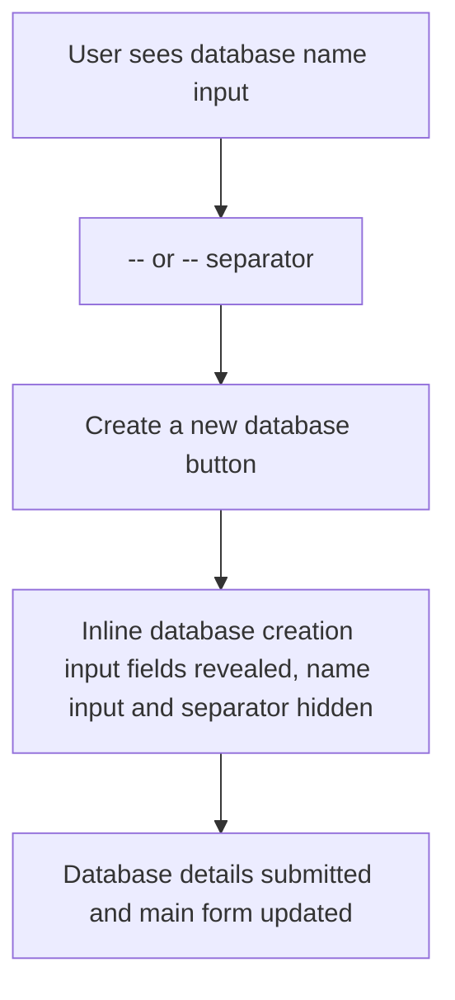
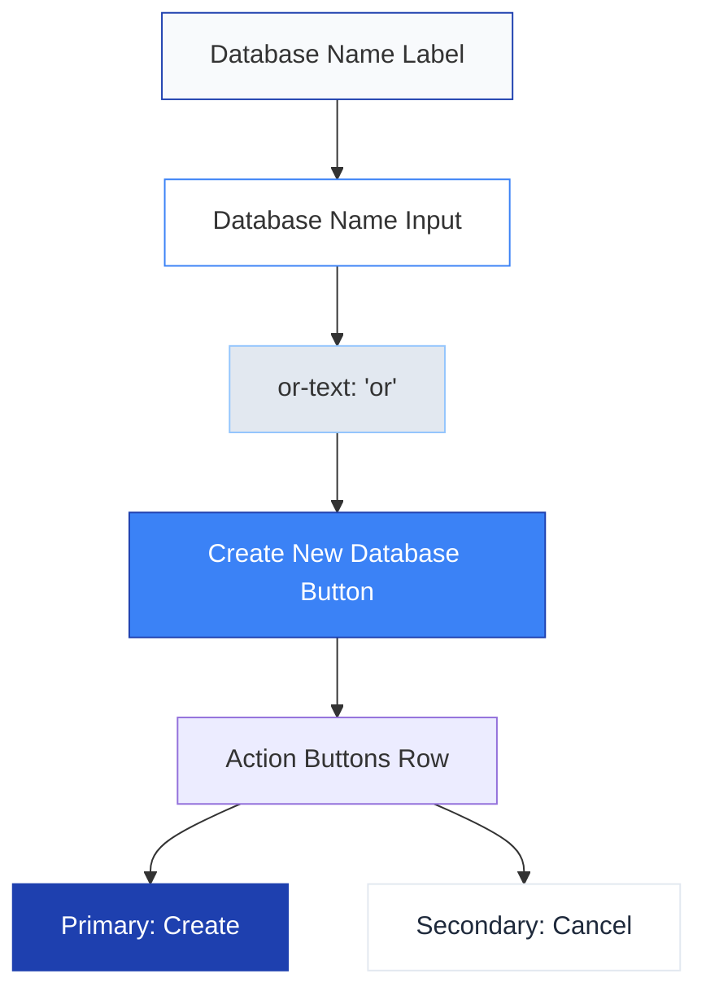

# Plan: Update Step 3 UI for Database Creation

## Overview

This plan describes the atomic steps to update the step 3 UI in the project creation workflow. The new UI will initially show a database name input, a separator, and a "Create a new database" button. When the button is clicked, the database creation input fields are revealed inline (not in a modal), and the database name input and separator are hidden. The user completes the inline form to create a new database, as specified in [`docs/datacloud.md`](../../docs/datacloud.md).

## Steps

1. **Update step 3 UI to initially show a database name input field, separator, and "Create a new database" button**
2. **When "Create a new database" is clicked, hide the database name input and separator**
3. **Reveal the database creation input fields inline below the button**
4. **Render DatabaseInfoForm inline with only the required fields for database creation (name, entitlement_bases, schemas, custom_tags)**
5. **Ensure submitting the inline form updates the main form with new database details**
6. **Update or add tests for the new inline UI behavior**
7. **Document the UI/UX flow and update architecture/ui-mockups as needed**

## UI Flow Diagram

## Notes

- The inline form will only allow creating a single database per submission.
- All changes will follow the Baby Steps™ methodology.
- Artifacts will be stored in the `architecture/` folder as per project rules.

## Step 1: Audit of Alignment and Spacing

- **Label and Input:** The "Database Name" label and input are left-aligned and use full width, but the vertical spacing between them is minimal (0.5rem). The input uses a standard border and padding.
- **Divider ("or"):** The divider uses flex with border lines and a centered "or" text. This creates a strong horizontal break, but may introduce excess vertical space and visual separation that feels disconnected from the form flow.
- **Button ("Create a new database"):** The button is full width and placed directly below the divider, but lacks vertical separation from the divider and may appear crowded.
- **Error Message:** Error text appears below the input with a small margin, which is consistent with standard form validation patterns.
- **Overall Layout:** All elements are stacked vertically with no explicit grouping or sectioning. There is no clear separation between the form fields and action controls.
- **Spacing Consistency:** Margins and paddings are inconsistent (e.g., margin-bottom on input vs. margin on divider), which may cause uneven visual rhythm.

**Summary:**  
The current form layout is functional but lacks consistent vertical spacing and grouping. The divider and button placement may disrupt the visual flow, and the lack of sectioning makes the form feel less organized.

---

## Step 2: Visual Clutter and Divider Analysis

- **Divider ("or") Element:**  
  The divider visually separates the "Database Name" input from the "Create a new database" button. It uses horizontal lines and a centered "or" label. While it clarifies the alternative actions, it introduces a strong visual break and adds vertical space, which can disrupt the form's flow and make the section feel fragmented.

- **Other Visual Clutter:**  
  No other vertical lines or excessive borders are present, but the lack of grouping and the abrupt divider may contribute to a cluttered appearance.

**Plan for Improvement:**  

- Remove or redesign the divider to use a subtler visual cue (e.g., a simple "or" text with minimal spacing, or a muted background chip).
- Group related actions together with consistent spacing.
- Ensure the form flows naturally from input to action, reducing unnecessary breaks.

---

## Step 3: Action Button Placement and Visibility

- **Current State:**  
  - The "Create a new database" button is full width and placed directly below the divider, with no clear grouping or separation from the input field.
  - There are no explicit "Save" or "Cancel" buttons in this step; these may be handled at the workflow level, but their absence in the inline form can reduce clarity for users who want to back out or confirm their action.
  - Button styling uses the `.btn` class, which is consistent with the theme, but lacks visual hierarchy (primary vs. secondary actions).

- **Issues:**  
  - The main action button is visually crowded by the divider and input.
  - Lack of secondary actions (Cancel, Save) may confuse users about how to proceed or revert.
  - No clear separation between form fields and action controls.

**Plan for Improvement:**  

- Place primary and secondary action buttons (e.g., "Create", "Cancel") in a horizontal row below the form fields, aligned right for primary and left for secondary actions, following the application's design patterns.
- Use clear, descriptive labels and consistent button styles (primary/secondary).
- Ensure sufficient spacing between buttons and from the form fields.
- If "Save" is not relevant at this step, ensure "Cancel" or "Back" is always visible and accessible.

---

## Step 4: Theming, Branding, and Accessibility Consistency

- **Current State:**  
  - Uses CSS variables for theme colors (e.g., `--theme-primary`, `--theme-border`), but not all elements (e.g., divider, error text) use these variables consistently.
  - Typography is not explicitly set; relies on inherited font, which may not match the design spec (Inter, sans-serif).
  - Button styles are consistent with the theme, but primary/secondary distinction could be clearer.
  - Accessibility:  
    - Inputs have labels, `aria-required`, and `aria-describedby` for errors.
    - Buttons have `aria-label` where appropriate.
    - No explicit keyboard navigation or focus state styling.
    - Error color (#e53e3e) is not checked for sufficient contrast with background.

- **Issues:**  
  - Inconsistent use of theme variables for all colors and backgrounds.
  - Typography may not match the design spec.
  - Button hierarchy (primary/secondary) is not visually distinct.
  - Accessibility can be improved with clearer focus states, color contrast, and keyboard navigation cues.

**Plan for Improvement:**  

- Ensure all colors and backgrounds use theme variables defined in the design system.
- Set font family explicitly to match the design spec.
- Use clear primary/secondary button styles as defined in the design system.
- Validate color contrast for error and action states.
- Add visible focus states for all interactive elements.
- Confirm all form fields and buttons are accessible via keyboard and screen readers.

---

## Step 5: Additional UI/UX Issues

- **Error Handling:**  
  - Only a single error message is shown for the database name field. There is no summary or indication for other potential errors (e.g., network, duplicate names).
  - Error messages could be more descriptive and actionable.

- **Responsiveness:**  
  - The form uses full-width inputs and buttons, but layout and spacing may not adapt well to smaller screens or mobile devices.
  - No explicit responsive breakpoints or stacking logic for action buttons.

- **Edge Cases:**  
  - No visible loading or disabled state for buttons during async operations.
  - No confirmation or feedback after successful creation or cancellation.

- **Visual Polish:**  
  - Lack of subtle visual cues (e.g., hover, active, or focus states) for interactive elements.
  - No microcopy or helper text to guide users through the form.

**Plan for Improvement:**  

- Add more granular and actionable error messages for all failure scenarios.
- Ensure the form layout and controls are fully responsive and mobile-friendly.
- Implement loading, disabled, and success states for all actions.
- Add helper text and microcopy where needed for clarity.
- Enhance visual feedback for all interactive elements.

---

## Step 6: Actionable Implementation Steps

1. **Alignment & Spacing**
   - Standardize vertical spacing between all fields and controls (use consistent margin/padding).
   - Group related fields and actions visually (e.g., use a section or card container).

2. **Remove Visual Clutter**
   - Replace the "divider-or" with a minimal, accessible alternative (e.g., muted "or" text or chip).
   - Remove unnecessary borders or lines.

3. **Action Button Placement**
   - Place primary and secondary action buttons in a horizontal row below the form fields.
   - Use clear labels: "Create", "Cancel", etc.
   - Apply primary/secondary button styles per design system.
   - Ensure sufficient spacing between buttons and from form fields.

4. **Theming, Branding, Accessibility**
   - Use theme variables for all colors and backgrounds.
   - Set font family to match design spec (Inter, sans-serif).
   - Validate color contrast for error and action states.
   - Add visible focus states for all interactive elements.
   - Ensure all controls are accessible via keyboard and screen readers.

5. **Additional UI/UX Improvements**
   - Add helper text and microcopy where needed.
   - Implement loading, disabled, and success states for actions.
   - Make form layout responsive for mobile and tablet.
   - Provide granular, actionable error messages for all failure scenarios.
   - Add visual feedback (hover, active, focus) for all interactive elements.

---

## Step 7: Improved Form Wireframe (Mermaid)

- All elements are vertically stacked with consistent spacing.
- The "or" is a subtle text, not a heavy divider.
- Action buttons are grouped in a horizontal row below the form fields, with clear primary/secondary distinction.

---
