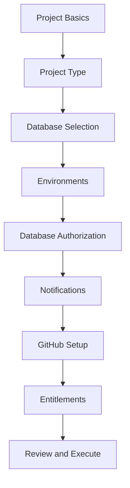

# Project Creation Stepper Update: Architectural Plan

## 1. Updated Stepper Flow and Step Order

The new stepper flow introduces six additional steps between "Project Type" and "Review and Execute". The updated order is:

1. Project Basics
2. Project Type
3. **Database Selection**
4. **Environments**
5. **Database Authorization**
6. **Notifications**
7. **GitHub Setup**
8. **Entitlements**
9. Review and Execute



**Legend:**  

- **Bold** steps are new additions.

This diagram reflects the intended user journey and stepper navigation for the revised project creation workflow.

---

## 2. Vue Component Structure for Expanded Stepper

Each step in the flow should be represented by a dedicated Vue Single File Component (SFC) in `frontend/src/components/ProjectCreation/steps/`. The following new components are required:

- `StepDatabaseSelection.vue` – Handles database selection and creation logic.
- `StepEnvironments.vue` – Manages environment configuration (e.g., DEV/QA/PROD).
- `StepDatabaseAuthorization.vue` – Collects database authorization details.
- `StepNotifications.vue` – Configures notification preferences.
- `StepGitHubSetup.vue` – Handles GitHub integration and repo setup.
- `StepEntitlements.vue` – Manages entitlements and access controls.

**Integration:**

- The main orchestrator (`ProjectCreationView.vue` or `ProjectCreationForm.vue`) should conditionally render each step component based on the current step.
- The stepper navigation (`HorizontalStepper.vue`) should be updated to include all steps in the correct order.
- Each step component should follow the established pattern: receive relevant state via props, emit updates/validation events, and integrate with the Pinia store.

**Example Directory Structure:**

```
frontend/src/components/ProjectCreation/steps/
  StepProjectBasics.vue
  StepSetUpType.vue
  StepDatabaseSelection.vue
  StepEnvironments.vue
  StepDatabaseAuthorization.vue
  StepNotifications.vue
  StepGitHubSetup.vue
  StepEntitlements.vue
  StepReviewExecute.vue
```

This modular structure ensures maintainability, testability, and clear separation of concerns for each step in the workflow.

---

## 3. TypeScript Type and Interface Updates

To support the expanded stepper, update the following in `frontend/src/types/project-creation.ts`:

### Step Definitions

- Extend the `StepDefinition[]` array to include all new steps, assigning unique `id`, `title`, `icon`, and `component` values for each.
- Example:

  ```typescript
  const stepDefinitions: StepDefinition[] = [
    { id: 1, title: 'Project Basics', icon: 'mdi-information', component: 'StepProjectBasics', required: true, completed: false, valid: false },
    { id: 2, title: 'Project Type', icon: 'mdi-cogs', component: 'StepSetUpType', required: true, completed: false, valid: false },
    { id: 3, title: 'Database Selection', icon: 'mdi-database-search', component: 'StepDatabaseSelection', required: true, completed: false, valid: false },
    { id: 4, title: 'Environments', icon: 'mdi-layers', component: 'StepEnvironments', required: true, completed: false, valid: false },
    { id: 5, title: 'Database Authorization', icon: 'mdi-key', component: 'StepDatabaseAuthorization', required: true, completed: false, valid: false },
    { id: 6, title: 'Notifications', icon: 'mdi-bell', component: 'StepNotifications', required: false, completed: false, valid: false },
    { id: 7, title: 'GitHub Setup', icon: 'mdi-github', component: 'StepGitHubSetup', required: false, completed: false, valid: false },
    { id: 8, title: 'Entitlements', icon: 'mdi-account-multiple-check', component: 'StepEntitlements', required: false, completed: false, valid: false },
    { id: 9, title: 'Review and Execute', icon: 'mdi-clipboard-check', component: 'StepReviewExecute', required: true, completed: false, valid: false }
  ]
  ```

### Navigation State

- Update the `NavigationState` interface to reflect the new total number of steps.
- Ensure `currentStep`, `completedSteps`, and `totalSteps` logic supports the expanded flow.

### Step Data Interfaces

- Define new interfaces for the data collected in each new step, e.g.:
  - `DatabaseSelectionData`
  - `EnvironmentsData`
  - `DatabaseAuthorizationData`
  - `NotificationsData`
  - `GitHubSetupData`
  - `EntitlementsData`
- Add these to the main `ProjectFormData` interface as new properties.

### Validation

- Ensure `StepValidationResult` and related validation logic are extended to cover all new steps.

These updates will ensure type safety, extensibility, and maintainability as the stepper grows.

---

## 4. Navigation and Validation Requirements

### Navigation Rules

- Users must complete required fields in the current step before proceeding to the next.
- Navigation to a step is only enabled if all previous required steps are valid.
- Users can navigate back to any previous step at any time.
- Optional steps (e.g., Notifications, GitHub Setup, Entitlements) can be skipped, but validation should still run if data is entered.
- The stepper visually indicates completed, current, and pending steps.

### Validation Gating

- Each step component is responsible for validating its own fields and reporting validity to the orchestrator.
- The orchestrator blocks forward navigation if the current step is invalid.
- Validation feedback is shown in real time as users interact with each step.
- The "Review and Execute" step performs a final validation of all steps before allowing project creation.

### User Experience

- Inline validation errors and warnings are displayed for each step.
- The stepper provides clear feedback on which steps are incomplete or invalid.
- Users are prompted to confirm navigation away from a step with unsaved changes or validation errors.
- Accessibility: All navigation and validation feedback must be accessible via keyboard and screen reader.

These requirements ensure a robust, user-friendly, and accessible multi-step workflow.
