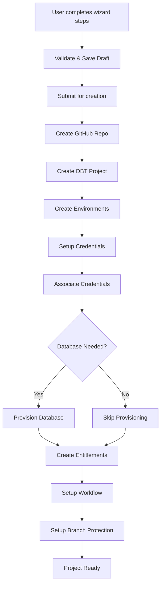

# Project Creation Workflow Plan
 
## Overview
 
This document describes the step-by-step workflow for creating a new project using the current implementation. It covers the UI wizard steps, validation and draft logic, backend orchestration, a Mermaid diagram of the process, and UI mockups for key steps.
 
---
 
## 1. UI Wizard Steps
 
Each step is atomic, validated, and can be saved as a draft.
 
1. **General Info** 
   - Enter project name, owner, and description.
2. **Setup Type** 
   - Choose between OAD or Classic setup.
3. **Database Selection** 
   - Enter existing database name, or create new database.
  3a. **Create new database **
    - Enter details for new database
4. **Environments** 
   - Select environments (development, QA, production).
5. **Database Authorization** 
   - Provide database authentication details.
6. **Notifications** 
   - Set support group and email distribution list.
7. **GitHub Setup** 
   - Specify GitHub team and repository details.
8. **Entitlements** 
   - Assign entitlement owner and technical owner.
9. **Review & Create** 
   - Review all information and trigger project creation.
 
---
 
## 2. Validation & Draft Logic
 
- Each step validates required fields before proceeding.
- Errors are shown inline for missing/invalid fields.
- Drafts are auto-saved on step/field change and can be manually saved/loaded/cleared.
 
---
 
## 3. Backend Orchestration Steps
 
Upon final submission, the backend performs these steps in order:
 
1. Create GitHub repository
2. Create DBT project
3. Create environments
4. Setup credentials
5. Associate credentials with environments
6. Provision database (if needed)
7. Create entitlements
8. Setup initial workflow
9. Setup branch protection
 
Each step updates progress and handles errors with user feedback.
 
---
 
## 4. Workflow Diagram
 

 
---
 
## 5. UI Mockups (Wireframe Descriptions)
 
- **General Info Step** 
  - Form with fields: Project Name, Owner, Description, Tags
  - Benefits list on the side

- **Setup Type Step**
   - OAD or Classic
   - Info on differences/benefits
- **Environments Step** 
  - Checkboxes for Development, QA, Production 
 
- **New Database Creation Step**
  - Business Area (required)
    - Allowed values: cl, claims, corporate, crm, it, pl
  - Environments (required)
    - Allowed values: DEV (always selected), QA, PROD (cannot be selected unless QA is also selected)
    - Selection logic:
      - DEV is always selected and cannot be deselected.
      - QA can be selected/deselected.
      - PROD can only be selected if QA is also selected.
  - For each Database:
    - Database Name (required)
    - Entitlement Bases (required, repeatable):
      - Name (required)
      - Owner (required)
      - TSO (required)
      - Read Only Owner (required)
      - Read Only TSO (required)
      - Add/Remove Entitlement Base controls
    - Schemas (repeatable):
      - Name
      - Purpose (raw, staging, user_managed, target, ods, published)
      - Data Retention Days
      - Restricted (checkbox)
      - Add/Remove Schema controls
    - Custom Tags (repeatable):
      - Tag
      - Support Group Name
      - Support Group Email
      - Add/Remove Custom Tag controls
    - Remove Database control
  - Add Database control
 
- **Review & Create Step** 
  - Summary of all entered data 
  - Edit buttons for each section 
  - "Create Project" button
 
---
 
## 6. Status
 
- All steps above are documented and visualized.
- Ready for review or implementation.
 
 