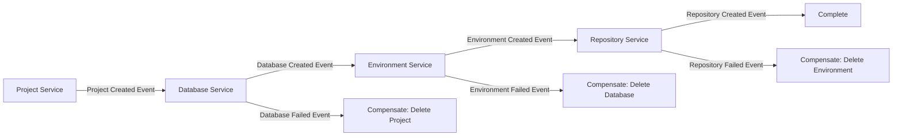
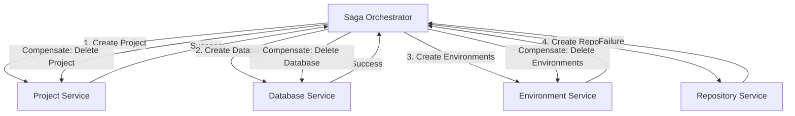

# Understanding the Saga Pattern for dbt Cloud Project Creation

## What is the Saga Pattern?

The Saga pattern is a design pattern for managing distributed transactions across multiple services. Instead of using traditional ACID transactions (which don't work well across service boundaries), a Saga breaks a transaction into a sequence of local transactions, where each local transaction updates data within a single service.

## Why Use Saga Pattern?

In the dbt Cloud project creation workflow, we need to coordinate multiple services:
- Project Service (creates the project entity)
- Database Service (provisions infrastructure)
- GitHub Service (creates repositories)
- Entitlements Service (assigns ownership)
- Notification Service (sends emails)

Traditional distributed transactions (2PC - Two-Phase Commit) would:
- Lock resources across all services
- Create performance bottlenecks
- Reduce system availability
- Be complex to implement

## How Saga Pattern Works

### 1. Basic Concept

A Saga is a sequence of transactions where:
- Each transaction is a local transaction within a service
- If a transaction fails, compensating transactions undo the previous successful transactions
- The saga either completes successfully or leaves the system in a consistent state through compensation

### 2. Types of Sagas

#### Choreography-Based Saga
Services communicate through events without central coordination:



#### Orchestration-Based Saga (Our Choice)
A central orchestrator manages the workflow:



## Implementing Saga for Project Creation

### 1. Saga Definition

```typescript
// src/services/sagas/ProjectCreationSaga.ts
export class ProjectCreationSaga {
  private steps: SagaStep[] = [
    {
      name: 'CREATE_PROJECT',
      transaction: this.createProject.bind(this),
      compensation: this.deleteProject.bind(this)
    },
    {
      name: 'PROVISION_DATABASE',
      transaction: this.provisionDatabase.bind(this),
      compensation: this.deprovisionDatabase.bind(this)
    },
    {
      name: 'CREATE_ENVIRONMENTS',
      transaction: this.createEnvironments.bind(this),
      compensation: this.deleteEnvironments.bind(this)
    },
    {
      name: 'SETUP_REPOSITORY',
      transaction: this.setupRepository.bind(this),
      compensation: this.cleanupRepository.bind(this)
    },
    {
      name: 'CREATE_CREDENTIALS',
      transaction: this.createCredentials.bind(this),
      compensation: this.deleteCredentials.bind(this)
    },
    {
      name: 'ASSIGN_ENTITLEMENTS',
      transaction: this.assignEntitlements.bind(this),
      compensation: this.revokeEntitlements.bind(this)
    }
  ];

  async execute(context: ProjectCreationContext): Promise<ProjectCreationResult> {
    const executedSteps: ExecutedStep[] = [];
    
    try {
      // Forward execution
      for (const step of this.steps) {
        const result = await this.executeStep(step, context);
        executedSteps.push({ step, result });
        
        // Update context with results for next steps
        context = this.updateContext(context, step.name, result);
      }
      
      return { success: true, data: context };
      
    } catch (error) {
      // Backward compensation
      await this.compensate(executedSteps, context);
      throw new SagaExecutionError('Project creation failed', error);
    }
  }

  private async compensate(
    executedSteps: ExecutedStep[], 
    context: ProjectCreationContext
  ): Promise<void> {
    // Compensate in reverse order
    for (const { step, result } of executedSteps.reverse()) {
      try {
        await step.compensation(context, result);
      } catch (compensationError) {
        // Log but continue - compensation should be idempotent
        console.error(`Compensation failed for ${step.name}:`, compensationError);
      }
    }
  }
}
```

### 2. Individual Step Implementation

```typescript
// Transaction: Create Project
private async createProject(context: ProjectCreationContext): Promise<ProjectResult> {
  const response = await this.api.post('/api/v1/dbt/projects', {
    name: context.projectName,
    description: context.description,
    owner: context.owner
  });
  
  return {
    projectId: response.data.id,
    projectData: response.data
  };
}

// Compensation: Delete Project
private async deleteProject(
  context: ProjectCreationContext, 
  result: ProjectResult
): Promise<void> {
  if (result?.projectId) {
    await this.api.delete(`/api/v1/dbt/projects/${result.projectId}`);
  }
}

// Transaction: Provision Database (Conditional)
private async provisionDatabase(context: ProjectCreationContext): Promise<DatabaseResult> {
  // Skip if using existing database
  if (context.databaseSelection === 'existing') {
    return { skipped: true, databaseId: context.existingDatabaseId };
  }
  
  // Create new database infrastructure
  const response = await this.api.post('/api/v1/admin/datacloud/provision-infra', {
    action: 'apply',
    environment: context.environment,
    business_area: context.businessArea,
    object_type: 'database',
    object_name: context.newDatabase.name
  });
  
  // Verify database creation
  await this.api.post('/api/v1/admin/snowflake/verify-database', {
    env: context.environment,
    user: context.snowflakeUser,
    password: context.snowflakePassword,
    database_details: {
      warehouse: context.newDatabase.warehouse,
      database: context.newDatabase.database,
      schema_: context.newDatabase.schema
    }
  });
  
  return {
    databaseId: response.data.databaseId,
    connectionDetails: response.data
  };
}

// Compensation: Deprovision Database
private async deprovisionDatabase(
  context: ProjectCreationContext,
  result: DatabaseResult
): Promise<void> {
  // Only compensate if we created a new database
  if (!result?.skipped && result?.databaseId) {
    await this.api.post('/api/v1/admin/datacloud/provision-infra', {
      action: 'teardown',
      environment: context.environment,
      business_area: context.businessArea,
      object_type: 'database',
      object_name: context.newDatabase.name,
      confirm_destroy: true
    });
  }
}
```

### 3. State Persistence

```typescript
// src/services/sagas/SagaStateManager.ts
export class SagaStateManager {
  async saveState(sagaId: string, state: SagaState): Promise<void> {
    await this.storage.set(`saga:${sagaId}`, {
      ...state,
      lastUpdated: new Date().toISOString()
    });
  }

  async loadState(sagaId: string): Promise<SagaState | null> {
    return await this.storage.get(`saga:${sagaId}`);
  }

  async markStepCompleted(
    sagaId: string, 
    stepName: string, 
    result: any
  ): Promise<void> {
    const state = await this.loadState(sagaId);
    if (!state) throw new Error('Saga state not found');
    
    state.completedSteps.push({
      name: stepName,
      completedAt: new Date().toISOString(),
      result
    });
    
    await this.saveState(sagaId, state);
  }
}
```

## Handling Complex Scenarios

### 1. Partial Failures

When a step partially succeeds (e.g., created 2 out of 3 environments):

```typescript
private async createEnvironments(context: ProjectCreationContext): Promise<EnvironmentResult> {
  const created: Environment[] = [];
  const failed: EnvironmentError[] = [];
  
  for (const env of context.environments) {
    try {
      const result = await this.createSingleEnvironment(env);
      created.push(result);
    } catch (error) {
      failed.push({ environment: env, error });
    }
  }
  
  if (failed.length > 0) {
    // Store what was created for compensation
    throw new PartialFailureError('Some environments failed', { created, failed });
  }
  
  return { environments: created };
}

private async deleteEnvironments(
  context: ProjectCreationContext,
  result: EnvironmentResult
): Promise<void> {
  // Delete all successfully created environments
  const environments = result.environments || [];
  
  for (const env of environments) {
    try {
      await this.deleteSingleEnvironment(env.id);
    } catch (error) {
      console.error(`Failed to delete environment ${env.id}:`, error);
    }
  }
}
```

### 2. Timeout Handling

```typescript
export class TimeoutAwareSaga extends ProjectCreationSaga {
  private readonly stepTimeouts = {
    CREATE_PROJECT: 30000,      // 30 seconds
    PROVISION_DATABASE: 300000, // 5 minutes
    CREATE_ENVIRONMENTS: 60000, // 1 minute
    SETUP_REPOSITORY: 120000,   // 2 minutes
  };

  protected async executeStep(
    step: SagaStep, 
    context: ProjectCreationContext
  ): Promise<any> {
    const timeout = this.stepTimeouts[step.name] || 60000;
    
    return Promise.race([
      step.transaction(context),
      this.createTimeoutPromise(timeout, step.name)
    ]);
  }

  private createTimeoutPromise(ms: number, stepName: string): Promise<never> {
    return new Promise((_, reject) => {
      setTimeout(() => {
        reject(new SagaTimeoutError(`Step ${stepName} timed out after ${ms}ms`));
      }, ms);
    });
  }
}
```

### 3. Idempotent Compensations

Compensations must be idempotent (safe to run multiple times):

```typescript
private async deleteProject(
  context: ProjectCreationContext,
  result: ProjectResult
): Promise<void> {
  if (!result?.projectId) return;
  
  try {
    // Check if project still exists
    await this.api.get(`/api/v1/dbt/projects/${result.projectId}`);
    
    // If it exists, delete it
    await this.api.delete(`/api/v1/dbt/projects/${result.projectId}`);
  } catch (error) {
    if (error.response?.status === 404) {
      // Project already deleted - that's fine
      return;
    }
    throw error;
  }
}
```

## Benefits for Project Creation Workflow

1. **Reliability**: Each step can fail independently without corrupting the entire system
2. **Visibility**: Clear tracking of which steps succeeded/failed
3. **Recoverability**: Can retry failed steps or compensate completed ones
4. **Flexibility**: Easy to add/remove/reorder steps
5. **Testability**: Each step and compensation can be tested independently

## Monitoring and Observability

```typescript
// src/services/sagas/SagaMonitor.ts
export class SagaMonitor {
  async recordSagaStart(sagaId: string, type: string): Promise<void> {
    await this.metrics.increment('saga.started', { type });
    await this.events.emit({
      type: 'SAGA_STARTED',
      sagaId,
      sagaType: type,
      timestamp: new Date()
    });
  }

  async recordStepExecution(
    sagaId: string, 
    stepName: string, 
    duration: number, 
    success: boolean
  ): Promise<void> {
    await this.metrics.recordDuration('saga.step.duration', duration, {
      step: stepName,
      success: success.toString()
    });
    
    if (!success) {
      await this.alerts.trigger({
        type: 'SAGA_STEP_FAILED',
        sagaId,
        stepName,
        severity: 'HIGH'
      });
    }
  }
}
```

## Conclusion

The Saga pattern provides a robust solution for managing the complex, multi-service project creation workflow in dbt Cloud. By breaking the process into discrete steps with compensations, we ensure:

- System consistency even when failures occur
- Clear visibility into the creation process
- Ability to recover from partial failures
- Maintainable and testable code structure

This pattern aligns perfectly with the Baby Steps™ methodology, as each step is atomic, validated, and documented independently.