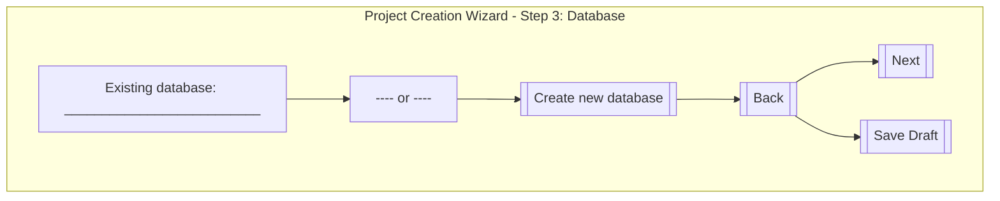

# Project Creation Wizard – Step 3: Database Selection

## Wireframe

---

## Key UI Components and Functionality

- **Existing Database Input**
  - Text input field for selecting or entering an existing database name.
  - May support autocomplete or dropdown for available databases.

- **Create New Database Button**
  - Action button to initiate creation of a new database.
  - Triggers a modal or navigates to a database creation form.

- **Navigation Buttons**
  - **Back**: Returns to the previous step.
  - **Next**: Proceeds to the next step (enabled only if a valid selection is made).
  - **Save Draft**: Saves the current progress as a draft.

---

## Validation and Behavior Notes

- **Validation**
  - If "Existing database" is used, the field must not be empty and must match a valid database.
  - If "Create new database" is chosen, user must complete the new database flow before proceeding.
  - Only one path (existing or new) can be active at a time.
  - "Next" is disabled until a valid selection or creation is complete.

- **Behavior**
  - Switching between existing and new database options resets the other input.
  - Error messages are shown for invalid or unavailable database names.
  - All navigation and action buttons are keyboard accessible and labeled for accessibility.

---

## Additional Notes

- UI should follow application theming and branding.
- All interactive elements must be accessible (WCAG-compliant).
- Refer to [`architecture/ui-mockups/project-creation-ascii-wireframes.md`](architecture/ui-mockups/project-creation-ascii-wireframes.md:39) for the original ASCII wireframe.
